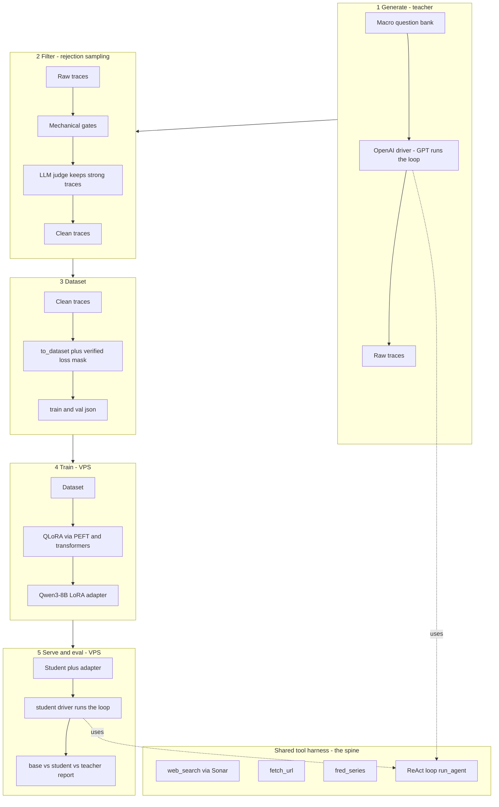

# Fine-Tune-Models — distilled agentic deep-research for global macro

Distill **frontier agent traces** into a small open-weight model (Qwen3-8B, QLoRA) that
performs **agentic deep research** for a global-macro fund: given a macro question it
plans, calls research tools, reads sources, and writes a cited findings report.

A teacher (GPT) runs a research loop over macro questions inside a **shared tool harness**;
the successful trajectories are filtered, converted to a loss-masked dataset, and used to
QLoRA-train the student. The **same harness** then drives the student at inference, which is
what makes a small distilled model actually transfer.

## Key ideas

- **One shared harness, swappable drivers.** The same `web_search` / `fetch_url` / `fred_series`
  tools, result formatting, and ReAct loop drive teacher generation (OpenAI) and student serving
  (vLLM, or local transformers via `HFDriver`). Identical environments = the distillation transfers.
- **Rejection sampling.** Only traces that completed with a cited report, used the tools,
  and passed an LLM judge (≥4/5) enter the training set — a small model learns bad habits
  fast, so quality gating is load-bearing.
- **Visible reasoning (the hidden-CoT fix).** Frontier reasoning models don't expose their
  chain-of-thought over the API, so the teacher is prompted to write `Thought:` reasoning
  in the message stream before each tool call — making the reasoning a trainable target.

## Architecture



## Stack

| Piece | Choice |
|---|---|
| Student | Qwen3-8B, QLoRA (4-bit NF4) via PEFT/transformers (`train/train_qlora.py`) |
| Teacher | GPT (GPT-5) via OpenAI API; judge GPT-5-mini |
| Tools | Perplexity Sonar (web search) · `fetch_url` · FRED (economic data) |
| Serving | local transformers (`HFDriver`), or vLLM (OpenAI-compatible) |
| Hardware | data pipeline on CPU/Mac · training + serving on 1× A100/H100 |

## Repo layout

```
macro_ds/   schema · formatting · tools · prompts · agent (ReAct loop) · drivers
            (OpenAI + vLLM + HF) · questions · filtering · judge · dataset · mask_check · metrics
gen/        make_questions · generate_traces · filter_traces · to_dataset
train/      train_qlora.py (direct QLoRA) · qlora_qwen3_8b.yaml + check_template_parity.py
            (LLaMA-Factory path, kept for reference)                    (run on VPS)
serve/      serve_vllm.sh · run_agent.py                                (run on VPS)
eval/       make_eval_set.py · run_eval_hf.py (no-vLLM 3-way) · run_eval.py   (run on VPS)
tests/      unit tests for every deterministic component
```

## Setup

```bash
python -m venv .venv && source .venv/bin/activate
pip install -e ".[dev]"
cp .env.example .env     # OPENAI_API_KEY, PERPLEXITY_API_KEY, FRED_API_KEY, TEACHER_MODEL, JUDGE_MODEL, SONAR_MODEL
pytest -q                # the data pipeline + harness are fully unit-tested
```

The data pipeline (question bank → trace generation → filtering → dataset) runs on CPU.
Training (QLoRA) and serving need a CUDA GPU + a CUDA build of torch (the RunPod PyTorch image
already ships it); then:

```bash
pip install peft bitsandbytes accelerate    # train/train_qlora.py; vLLM only if serving via vLLM
```

## Usage

End-to-end commands are in **`RUNBOOK.md`** (generate → train → serve → eval). Train with
`train/train_qlora.py` (tokenizes via the verified `render_and_mask`, so the loss mask matches
the real Qwen3 template — no separate parity gate needed). Evaluate base-vs-student-vs-teacher with
`eval/run_eval_hf.py` (no vLLM required). Stage it: a cheap **Stage 0** smoke test (~20 traces) to
prove the loop, then the **Stage 1** run (~150–500 traces).

## Status

**Stage 0 proven end-to-end** on an H100: generate (gpt-5) → filter (gpt-5-mini judge) → QLoRA →
student runs in the shared harness; train/serve parity holds. See `docs/results/2026-06-01-stage0.md`
for the base-vs-student-vs-teacher comparison. Stage 1 (scale-up) is next.

## License

Proprietary — internal research tooling. All rights reserved.
